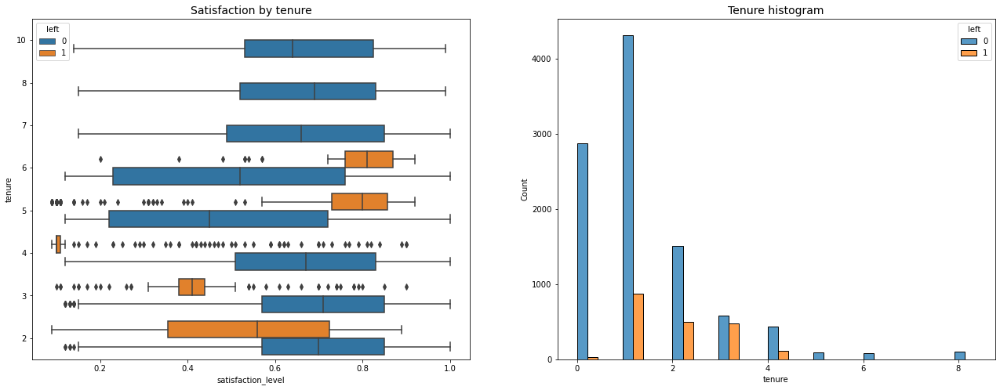
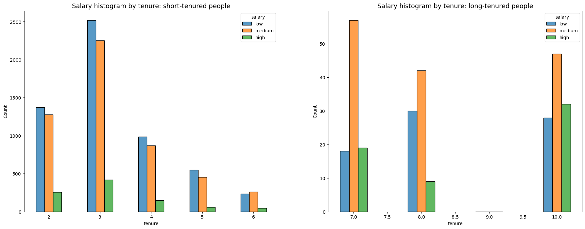
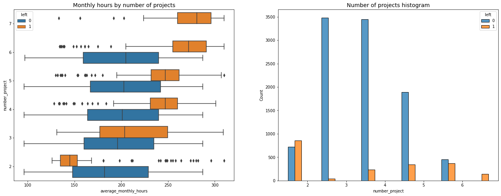
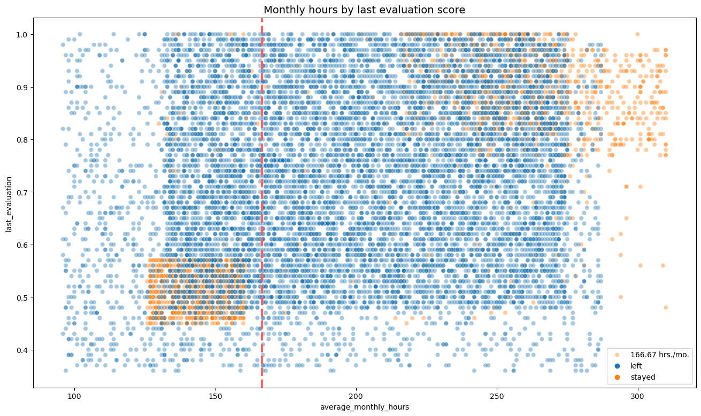
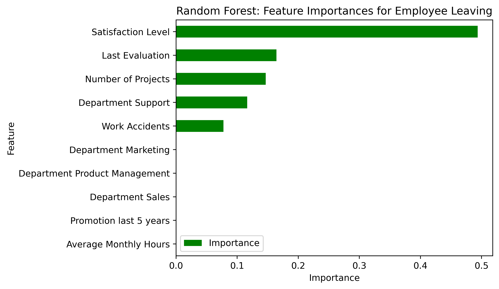

# Data-Driven Employee Turnover Prediction Overview
I use a random forest model to predict....

### Problem
What’s likely to make the employee leave the company?

### Objectives
Build a model that predicts whether or not an employee will leave the company and predict employees likely to quit. Identify factors that contribute to their leaving.

### Data Understanding
The data we use has 15k rows and 10 columns of data. Before we begin, we first understand some of the important variables. In this case, the tenure, the salary, the number of projects, and the evaluation score. The description of the variables is described on the <a href="https://github.com/pbmedinaPH/RF-Employee-Turnover-Prediction/blob/main/Data%20dictionary.md">data dictionary</a> of the repository. We first discuss the salary histogram of both the short and long-tenured employees and then their satisfaction level. Next, we discuss the number of projects by the job tenure and the number of hours, followed by the monthly hours and evaluation score scatterplot.

 

The first plot shows that workers who quit can be grouped into two main types: those who were unhappy and didn't stay for long, and those who were very satisfied but had moderate-length stays.
Those who worked for four years before leaving appear to have been less satisfied than usual. It's worth looking into any changes in company rules around the four-year mark to see if that affected their satisfaction.
The employees who stayed the longest were also the most content and had satisfaction levels similar to newer employees who stayed. The graph indicates that there aren't many employees with longer tenures, and it's possible that they are higher-ranking or better-paid employees. The second plot above shows that long-tenured employees were not disproportionately comprised of higher-paid employees.

 

 

The next 2 plots shows that Some employees left the company in two main groups: Those who worked less than their peers, and those who worked a lot more. Those who worked less than their peers with the same number of projects might have been fired or already planning to leave, so they got fewer hours. Others who worked a lot more likely chose to quit. These employees probably made significant contributions to their projects and might have been the key players in those projects. Basically, the plot shows that it's best for employees to handle 3-4 projects. When looking at those who left or stayed, the difference is minimal. Assuming a standard workweek and vacation time, employees typically work around 166.67 hours per month. Interestingly, even those who stayed or didn't leave the company seem to be working a lot more than this, suggesting that employees might be working too much. The 4th plot shows a correlation between the hours worked and evaluation scores. This means that the upper left quadrant of this plot doesn't have a large percentage of employees that leave that has lower work hours and a high evaluation score, and putting in long hours doesn't necessarily ensure a high evaluation score. Most of the employees are overworked. However, those who left the company and those who stayed are somewhat related to the evaluation scores.

### Data Analysis and Evaluation
testing

### Conclusion
Testing

### Key takeaways
- test1
- test2
- test3
