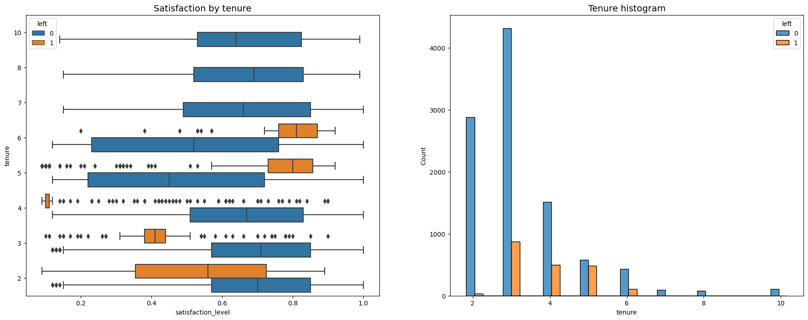

# Data-Driven Employee Turnover Prediction Overview
I use a random forest model to predict....

### Problem
What’s likely to make the employee leave the company?

### Objectives
Build a model that predicts whether or not an employee will leave the company and predict employees likely to quit. Identify factors that contribute to their leaving.

### Data Understanding
The data we use has 15k rows and 10 columns of data. Before we begin, we first understand some of the important variables. In this case, the tenure, the salary, the number of projects, and the evaluation score. The description of the variables are described on the <a href="https://github.com/pbmedinaPH/RF-Employee-Turnover-Prediction/blob/main/Data%20dictionary.md">data dictionary</a> of the repository. We first discuss the salary histogram of both the short and long-tenured employees then their satisfaction of the job. Next, we discuss the number of projects by the job tenure and the number of hours, followed by the monthly hours and evaluation score scatterplot

### Data Analysis and Evaluation
testing

### Conclusion
Testing

### Key takeaways
- test1
- test2
- test3
