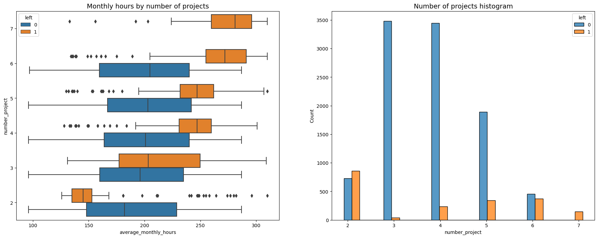

# Data-Driven Employee Turnover Prediction Overview
I use a random forest model to predict....

### Problem
What’s likely to make the employee leave the company?

### Objectives
Build a model that predicts whether or not an employee will leave the company and predict employees likely to quit. Identify factors that contribute to their leaving.

### Data Understanding
testing

### Data Analysis and Evaluation
testing

### Conclusion
Testing

### Key takeaways
- test1
- test2
- test3
