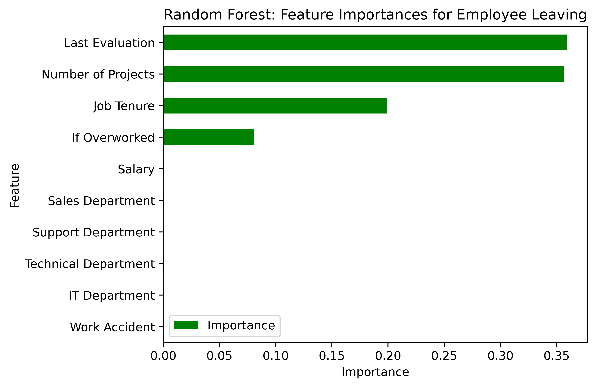

# Data-Driven Employee Turnover Prediction Overview
In this analysis, our objective is to develop a predictive model for employee attrition, identifying key factors influencing attrition and providing insights to enhance retention strategies. The dataset which has 15,000 rows and 10 columns, includes variables such as tenure, salary, projects, and evaluation scores. Initial observations reveal distinct patterns among departing employees, with factors such satisfaction levels, tenure, extended working hours, number of projects, and evaluation score. We then employ a random forest model with 300 decision trees. The model achieves a 93.8% AUC, with 96.2% accuracy and 87% precision. Last Evaluation, Number of Projects, Job Tenure, and whether an employee is overworked are significant contributors to predict whether an employee will leave. These findings may give insights to proactively address attrition challenges and imporve employee retention.

### Problem
What’s likely to make the employee leave the company?

### Objectives
Build a model that predicts whether or not an employee will leave the company and predict employees likely to quit. Identify factors that contribute to their leaving.

### Data Understanding
The data we use has 15k rows and 10 columns of data. Before we begin, we first understand some of the important variables. In this case, the tenure, the salary, the number of projects, and the evaluation score. The description of the variables is described on the <a href="https://github.com/pbmedinaPH/RF-Employee-Turnover-Prediction/blob/main/Data%20dictionary.md">data dictionary</a> of the repository. We first discuss the salary histogram of both the short and long-tenured employees and then their satisfaction level. Next, we discuss the number of projects by the job tenure and the number of hours, followed by the monthly hours and evaluation score scatterplot.

 

The first plot shows that workers who quit can be grouped into two main types: those who were unhappy and didn't stay for long, and those who were very satisfied but had moderate-length stays.
Those who worked for four years before leaving appear to have been less satisfied than usual. It's worth looking into any changes in company rules around the four-year mark to see if that affected their satisfaction.
The employees who stayed the longest were also the most content and had satisfaction levels similar to newer employees who stayed. The graph indicates that there aren't many employees with longer tenure, and they may be higher-ranking or better-paid employees. The second plot above shows that long-tenured employees were not disproportionately comprised of higher-paid employees.

 

 

The next 2 plots show that some employees left the company in two main groups: Those who worked less than their peers, and those who worked a lot more. Those who worked less than their peers with the same number of projects might have been fired or already planning to leave, so they got fewer hours. Others who worked a lot more likely chose to quit. These employees probably made significant contributions to their projects and might have been the key players in those projects. Basically, the plot shows that employees should handle 3-4 projects. When looking at those who left or stayed, the difference is minimal. Assuming a standard workweek and vacation time, employees typically work around 166.67 hours per month. Interestingly, even those who stayed or didn't leave the company seem to be working a lot more than this, suggesting that employees might be working too much. The 4th plot shows a correlation between the hours worked and evaluation scores. This means that the upper left quadrant of this plot doesn't have a large percentage of employees who leave that have lower work hours and a high evaluation score, and putting in long hours doesn't necessarily ensure a high evaluation score. Most of the employees are overworked. However, those who left the company and those who stayed are somewhat related to the evaluation scores.

 
In summary, employees are leaving the company due to suboptimal people management. This is connected to factors such as prolonged working hours, lots of projects, and feeling generally unhappy. The absence of promotion and good evaluation scores despite extended working hours can contribute to dissatisfaction. Many workers here might be really tired out. Additionally, if someone has been at the company with a tenure exceeding six years, they tend to exhibit a lower likelihood of leaving the company.

### Data Analysis and Evaluation
Since the variable we want to predict is categorical, we use a random forest model which has 300 decision trees to identify the feature importance of the variables. We use 2 rounds of random forest to eliminate the data leakage where we expect a drop of AUC in the 2nd round. By using feature engineering, we drop the satisfaction level and create a new 'overworked' variable to replace the average hours per month which describe wether an employee is overworked or not. The improved random forest model shows an AUC of 93.8% with an accuracy and precision of 96.2% and 87% respectively. The model has a slightly lower metric score compared to the first round of random forest but the model still shows a well-performing model.

The plot above shows that in this random forest model, Last Evaluation, Number of Projects, Job Tenure, and if the employee is overworked have the highest importance, in that order. These variables are most helpful in predicting the outcome variable wether or not the employee will leave.

### Conclusion
The random forest model demonstrates positive outcomes in discerning factors influencing whether an employee will remain with the company. It aids in forecasting employee departures and pinpointing the most impactful factors. Such findings empower HR to make informed decisions aimed at enhancing employee retention.

### Key takeaways
- Last Evaluation, Number of Projects, Job Tenure, and if the employee is overworked have the highest importance
- The random forest model shows a good result with an AUC of 93.8%
- Feature engineering of the data to minimize data leakage gives a proper identification of the variables that could affect wether the employee will leave or not
